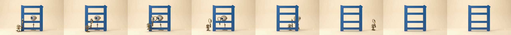
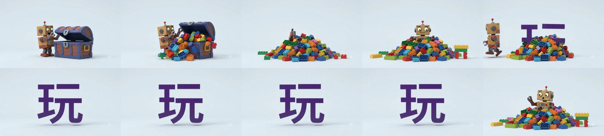
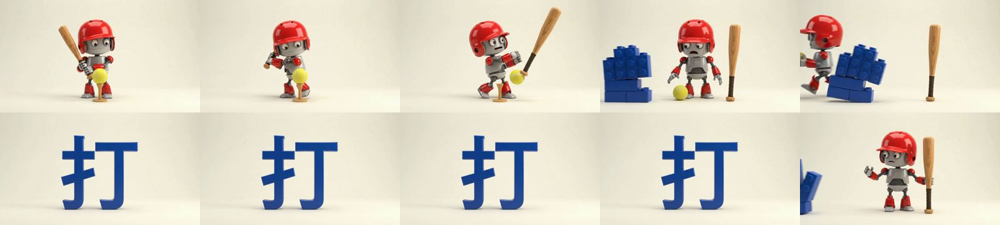
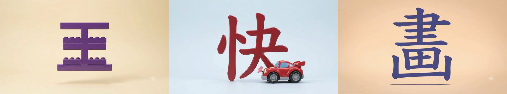
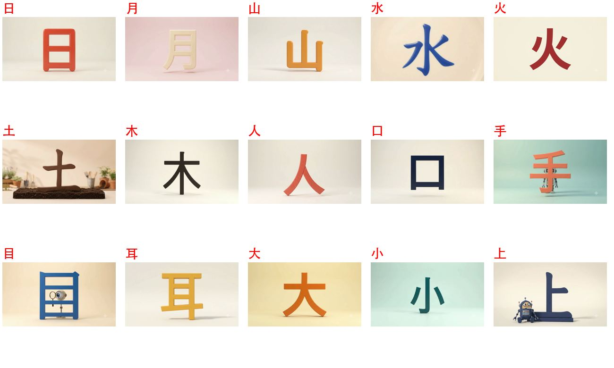
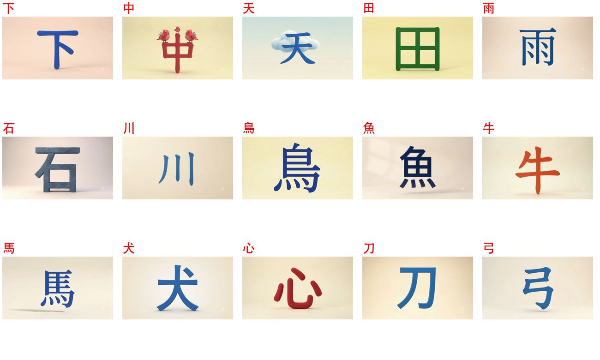
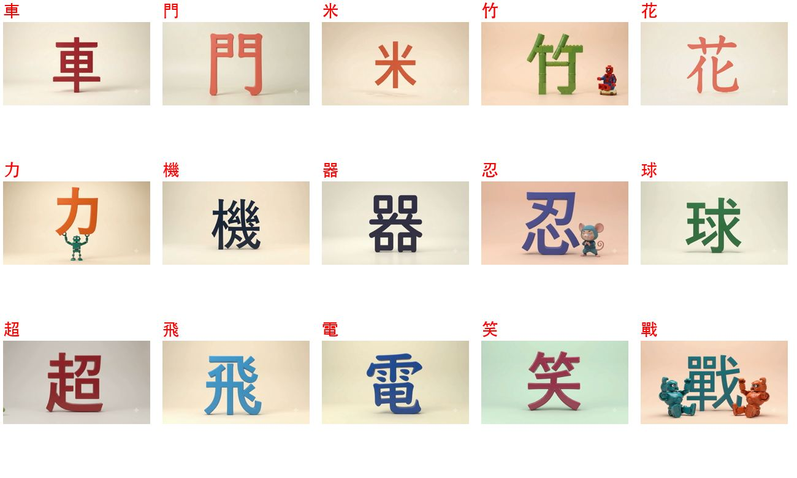
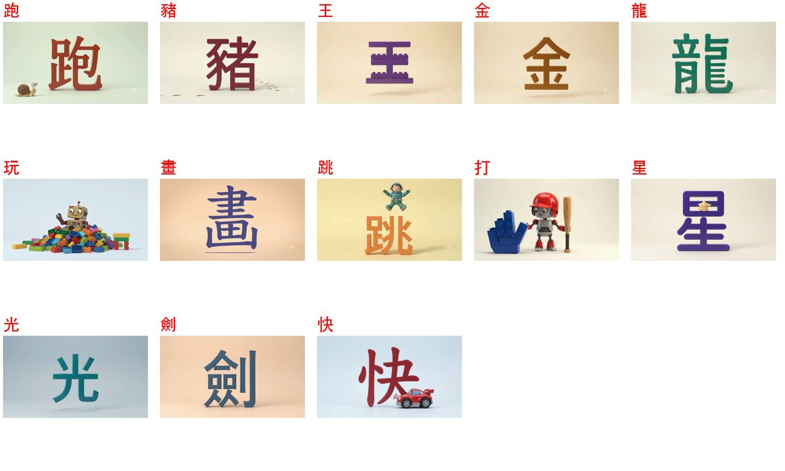

# 01 · 字卡內容與已上架影片檢查

2026-09-26 夜間檢查。範圍：`data/characters.json` 71 張字卡、`data/prompts/*.json` 目前使用中的 prompt、58 支已上架影片。
**這份報告沒有改動任何資料**，以下每一項都等你決定。

## 先看這三件（影響孩子實際看到的字）

| # | 字 | 問題 | 建議 |
|---|---|---|---|
| A | **目** | 影片從頭到尾都是「框 + **三**條橫線」（四個格子），像梯子，不是正確的目（應為兩條內橫、三格）。prompt 寫的是對的，是影片模型畫錯。 | 暫停使用這支，重新生成 |
| B | **玩**、**打** | 第 5–9 秒字形正確，但**最後約 1 秒硬切回開場畫面**（積木堆／機器人），孩子看到的最後一格沒有字，接著就進筆順描字。 | 重新生成；或在 prompt 模板強調「最後一格必須是字」（見 03 報告） |
| C | **王** | 倒數約 1 秒時積木重新堆疊，最後一格變成**上下共 5 層橫條**，已不是王；倒數 2 秒時仍是正確的王。 | 同 B |

## 次要：影片字形可讀但不乾淨

- **畫**：最後一格字下方多了一條分離的細線（蠟筆畫出的「最後一橫」沒有併進字裡），看起來像多一筆。
- **快**：小車停在「夬」的捺尾上，遮住收筆。
- **戰**：最後 0.6 秒兩台機器人跳進來，遮到「單」的底部和「戈」的撇。
- **中**：中間那豎幾乎沒有伸出框的上緣（小鳥站在上面），和標準字形比偏短。
- **竹**：用積木拼成，右半「丁」的形狀偏離印刷體；旁邊的角色是**樂高蜘蛛人**，跟 prompt 規定的原創角色不符（家用沒問題，只是之後要公開分享要留意）。
- **土**、**川**：結尾各有一次鏡頭跳切（土是底座從灰變成泥土，川是整個字縮小），字形本身沒問題。

58 支影片最後一格的總覽：

檢查方法：每支取倒數 2.0／1.2／0.6／0.1 秒四格，計算相鄰兩格的像素差，差異大的逐支人工看過；另外把 58 支的最後一格拼成總覽，逐字看。

## 字卡上的舊 `concept` 有筆畫錯誤（會影響之後重新生成）

`server/prompt-generation.mjs` 會把字卡 `concept` 當作 `previousConcept` 送給 AI。目前使用中的 prompt 都已經寫對了，但字卡本身還留著最早期的描述，下次按「換個創意，重新生成」時，錯的描述可能被帶回去：

| 字 | 字卡上寫的 | 實際 |
|---|---|---|
| 口 | "the four strokes of a box" | 口是 **3 筆**（豎、橫折、橫） |
| 米 | "four dots around a central cross" | 上兩點、下面是撇和捺；目前的 prompt 甚至特別寫了 *do not make … four dots around a cross* |
| 木 | "the roots spread into the base" | 木**沒有底橫**；橫在上面，下面是撇、捺 |
| 龍 | object 是 dragon，hook 卻寫「玩具**恐龍**」 | 龍和恐龍不同，影片 prompt 裡是龍 |
| 忍 | object 只寫「忍者」（中文），hook 講的是小老鼠和羽毛 | 欄位不一致 |
| 走 | hook 用「牠」指發條玩具人 | 應為「它」 |

建議：把這幾張字卡的 `concept` 更新成跟目前 prompt 一致的描述（Studio 的編輯字卡就能改）。

## 注音與語詞

71 字的注音逐一核對，**沒有發現錯誤**。多音字（中、車、打、喝、石、頭、花、長高的長）目前選的語詞讀音都跟字卡注音一致。程式檢查也全數通過：每個詞都含本字、同字底下圖示不重複、每字 1–4 個詞。

以下是可以更好的地方，不算錯：

| 字 | 語詞 | 說明 |
|---|---|---|
| 弓 | 彈弓🪃 | 🪃 是**迴力鏢**，不是彈弓。沒有彈弓圖示，可以改成「弓箭手🏹」之類，或拿掉圖示 |
| 星 | 火星🪐 | 🪐 是土星（有環）；火星可用 🔴 |
| 吃 | 吃飽🤤 | 🤤 是流口水，比較像「好想吃」；吃飽可用 😌 或 🫃 |
| 龍 | 恐龍、劍龍、水龍頭 | 三個詞都不是「龍」本身（兩個恐龍、一個水龍頭）。可以考慮換一個成 **龍舟🛶**（端午節，孩子有機會看到） |
| 目 | 題目、目標、節目 | 都是抽象詞，沒有一個跟「眼睛」有關，孩子較難把字形和意思連起來。可考慮「目光👀」，或接受現況 |
| 犬 | 犬齒🦷 | 6 歲比較少聽到；警犬、導盲犬很好 |
| 土 | 土撥鼠🐿️ | 🐿️ 是花栗鼠，沒有土撥鼠圖示，可以接受 |
| 魚 | 金魚🐠 | 🐠 是熱帶魚，可以接受 |

## 沒有影片的字

- **足**、**羊**：字卡是 `live`，但沒有已上架影片（足的資料夾裡有 3 個檔，見 04 報告）。
- 其他 11 個字（腳走吃喝眼頭家書果高黑）還在 `prompted`，等影片。
