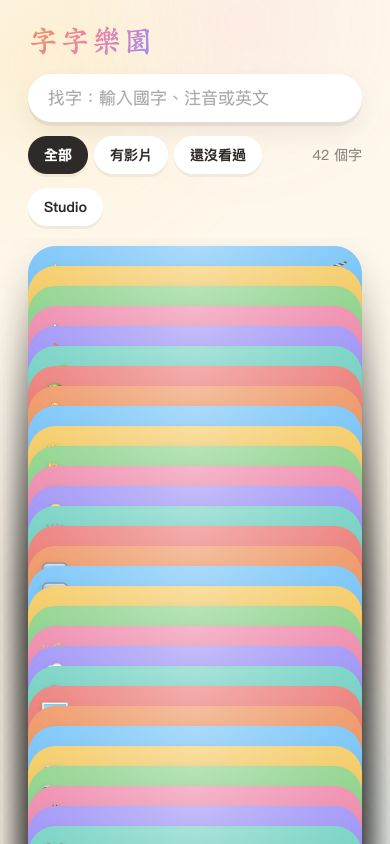
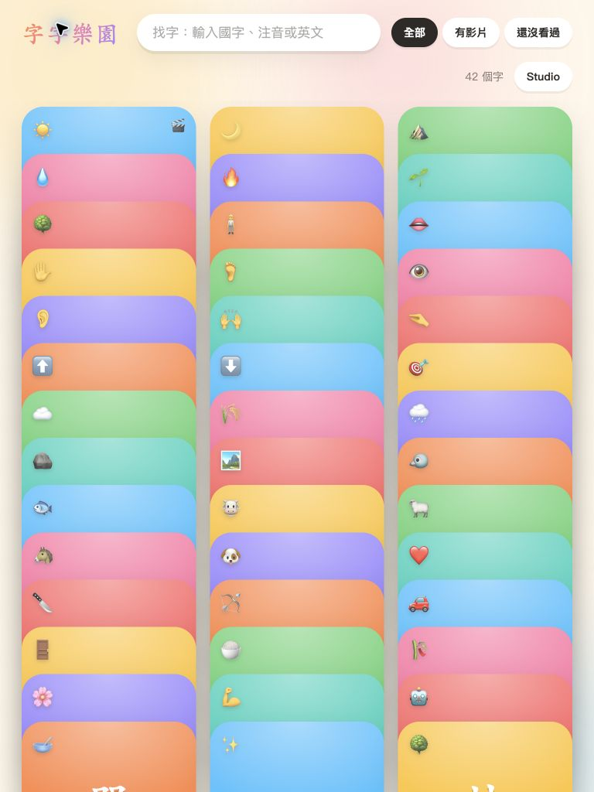
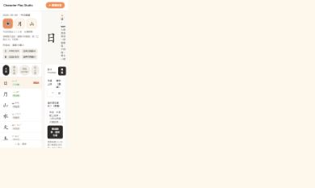

# 字字樂園：兒童教學與介面設計完整測試報告

測試日期：2026-09-09（Asia/Taipei）

專案版本：`0.1.0`；Git 基準：`a27ab61`，含當時工作目錄資料。

對象：README 定義的約 6 歲識字兒童，以及協助製作教材的家長。
方法：Chrome 真實介面操作、畫面檢查、DOM 幾何量測、程式碼查核與既有自動測試。這是專家觀點的啟發式評估，沒有招募兒童參與，不能視為已證實的學習成效研究。

## 1. 測試結論

**桌面版的核心製作與觀看流程可運作；手機與平板首頁存在嚴重字卡重疊，暫不適合讓孩子在這些尺寸獨立使用。**

已實際操作搜尋、篩選、字卡觀看、影片播放／暫停／重播／全螢幕／速度選單、圖片觀看、今日建議、生成工具切換、本機模板、複製、每日製作記錄、版本切換、AI 取消、素材預覽與審核、六種回饋、新增字與輸入驗證。`npm test` 的 24 項測試全部通過，`npm run build` 成功。

最需要先處理的問題：

1. **首頁字卡互相覆蓋**：390px 與 768px 寬均重現，點卡片可能開到其他字。
2. **手機播放器導覽超出畫面**：下一字按鈕與觀看次數部分或全部不可見。
3. **教學文字對比不足**：白字搭配目前八種淺色背景，基底色計算僅約 1.58–2.78:1；小注音尤其吃力。
4. **圖片教學發音不一致**：Studio 要求試聽並保存朗讀設定，但播放器圖片分支沒有朗讀呼叫，屬程式碼確認的功能落差。
5. **家長操作回饋不完整**：重複字只顯示 `exists`；空篩選沒有說明；備用模板仍顯示 CLI／模型文字。

測試沒有修改產品程式碼，也沒有修正上述問題。本報告與 `assets/` 截圖是交付物。

## 2. 環境、資料與證據界線

| 項目 | 本次條件 |
| --- | --- |
| 啟動方式 | `npm run dev:test`，獨立測試字庫 |
| 播放器 | `http://127.0.0.1:5181/` |
| 製作端 | `http://127.0.0.1:5181/studio` |
| 執行環境 | 使用者 Mac 上的 Chrome；未記錄 Chrome 精確版本 |
| 桌面視窗 | 約 1800 × 1074 CSS px 的測試畫面 |
| 響應式覆核 | 390 × 844、768 × 1024；瀏覽器 viewport 模擬，非實體觸控裝置 |
| 初始字庫 | 40 個字；測試新增「雲」「林」後 42 個字 |
| 資料隔離 | 測試資料放在系統暫存 `cps-browser-6Gzv0p`，正式字庫與媒體不作測試寫入 |
| 正式工作目錄 | 開始前 `data/characters.json` 已有未提交變更；本次沒有覆寫或回復它 |
| 影片樣本 | 正式素材「日」影片的兩份隔離副本；實際長度 10.005 秒 |
| 圖片樣本 | 1 × 1 PNG，僅驗證圖片流程，不代表合格識字教材 |
| 失敗樣本 | 假 `.mp4` 檔，驗證無法解碼的素材審核 |
| AI | 實際啟動一次 Codex 生成並取消；完成生成與多版本操作使用本機模板 |

### 狀態定義

- **通過／UI**：有實際操作與可見結果。
- **問題／UI**：實際操作重現錯誤或明確可用性障礙。
- **部分／UI**：完成部分動作，但未確認完整結果或感官品質。
- **程式碼**：由原始碼確認或推導，沒有冒充介面實測。
- **自動測試**：既有測試驗證的條件，不能替代真人操作與畫面檢查。
- **受阻／未測**：原因明列，不算通過。

### 重要限制

1. 檔案選擇器已開啟，但 Chrome 擴充功能拒絕 `setFiles`，回覆 `Not allowed`。沒有成功完成瀏覽器上傳。後續素材直接準備在**隔離測試資料夾**，僅用來驗證下游審核與播放。
2. 檔案拖放、多檔匯入、全部副檔名與大小限制沒有完成 UI 驗證。API 匯入流程另有既有自動測試。
3. 末段瀏覽器控制連續兩次逾時，鍵盤焦點巡檢與全部字卡逐張巡檢未完成。逾時是測試工具狀況，沒有證據判定網站當機。
4. 沒有以聆聽量測方式評定台灣華語準確度、音量舒適度、朗讀同步與聲音重疊。測試中勾選的「發音正確／音量舒服」只驗證控制流程，**不代表教材聲音已驗收**。
5. 實體 iPad／手機、Safari／Firefox、VoiceOver、離線重試、跨午夜、極慢載入、完整 AI 成功生成與全部現有影片內容仍待補測。
6. 不宣稱「所有功能全部通過」，也不以部分案例計算整個產品的通過率。

## 3. 兒童教學與設計評估基準

重點是孩子能否自主選擇、看清目標字、理解圖像與字義關係，並得到不造成壓力的回饋。成人引導應支持孩子主動探索，教學需要依個別能力與語言背景調整；這些原則參考 [NAEYC：Teaching to Enhance Each Child’s Development and Learning](https://www.naeyc.org/node/3812)。

介面檢查採用下列基準：

| 面向 | 驗收問題 |
| --- | --- |
| 自主操作 | 不會打字的孩子，能否看到並點中自己想看的字？ |
| 字形與注音 | 字是否完整、清楚、繁體正確？注音是否易辨識？ |
| 認知負荷 | 一次需要做幾個決定？裝飾會不會遮住主要學習訊息？ |
| 多感官一致 | 圖片、影片與字卡能否提供一致的目標字與發音？ |
| 節奏與掌控 | 能否暫停、重看、返回？是否有不被催促的思考時間？ |
| 回饋與學習證據 | 是否清楚區分「看過」與「會認」？ |
| 成人製作防呆 | 不合格素材會不會直接出現在兒童端？錯誤是否告訴家長怎麼處理？ |
| 無障礙與響應式 | 小螢幕、鍵盤操作、低視力與動態效果偏好是否被照顧？ |

文字對比以一般文字至少 4.5:1、大型文字至少 3:1 作為參考，見 [W3C：Contrast (Minimum)](https://www.w3.org/WAI/WCAG22/Understanding/contrast-minimum)。點擊目標的 WCAG 2.2 AA 基準是 24 × 24 CSS px 或符合其間距等例外；兒童操作區建議以更大的 44–48px 作為**本產品設計目標**，不能把它誤稱為 AA 一律要求。見 [W3C：Target Size (Minimum)](https://www.w3.org/WAI/WCAG22/Understanding/target-size-minimum.html)。

## 4. 播放器逐項操作紀錄

| ID | 功能與步驟 | 預期 | 實際結果／判定 |
| --- | --- | --- | --- |
| P01 | 開啟首頁 | 列出全字庫 | 顯示 40 個字、emoji、國字與注音。通過／UI；小螢幕另見 R01 |
| P02 | 點「有影片」，當時沒有上架影片 | 無結果且不出現待確認素材 | 顯示 0 / 40 與空結果提示。通過／UI |
| P03 | 切回「全部」，搜尋「日月」 | 同時找到兩字 | 顯示 2 / 40。通過／UI |
| P04 | 在「日月」搜尋結果按 Enter | 開啟第一個結果 | 開啟「日」。通過／UI |
| P05 | 第一個字檢查上一個按鈕 | 邊界禁用 | 「上一個」禁用。通過／UI |
| P06 | 無影片的「日」等到動畫結束 | 完成才記一次 | 顯示看過 1 次。通過／UI |
| P07 | 按「再看一次」並等完 | 再增加一次 | 看過 1 → 2 次，沒有立即加次。通過／UI |
| P08 | 按下一字「月 →」 | 依搜尋結果換字 | 開啟月；最後一字的下一個禁用。通過／UI |
| P09 | 按鍵盤左方向鍵 | 回前一字 | 月 → 日。通過／UI |
| P10 | 按 Esc | 回字庫且保留查詢 | 返回「日月」結果。通過／UI；焦點落在頁面，未見返回原字卡 |
| P11 | 點「還沒看過」 | 排除已完成的日 | 僅剩月，1 / 40。通過／UI |
| P12 | 搜尋「ㄩㄝ」 | 可用部分注音找字 | 找到月。通過／UI |
| P13 | 搜尋「sun」 | 可用英文找字 | 找到日。通過／UI |
| P14 | 搜尋「不存在abc」再按 Enter | 空結果不開錯字 | 顯示沒有符合的字，沒有打開播放器。通過／UI |
| P15 | 點首頁 Studio | 進製作端 | 直接進入，無角色切換門檻。通過／UI；兒童誤入風險見 D06 |
| P16 | 影片上架後回播放器，點有影片 | 只有上架影片符合 | 1 / 42，只有日帶 🎬；月圖片不算影片。通過／UI |
| P17 | 點日的影片卡 | 播放目前使用版本 | 實際載入 `/media/qa-sun-v2.mp4`，自動播放。通過／UI |
| P18 | 影片等到結尾 | 計次且顯示更新 | 日從 2 → 3 次。通過／UI |
| P19 | 點再看一次，點原生暫停 | 重頭播且能暫停 | `currentTime ≈ 0.378`、`paused=true`。通過／UI |
| P20 | 點原生播放恢復 | 續播並在完成後記次 | 最後日顯示看過 4 次。通過／UI |
| P21 | 點全螢幕，再點退出全螢幕 | 能進出全螢幕 | 控制樹切換成全螢幕，再回頁面。通過／UI；單次 Esc 未即時退出，未定性為網站缺陷 |
| P22 | 展開更多功能 → Playback speed → 0.75 | 可調整速度 | DOM 的 `playbackRate=0.75`。通過／UI；聽感未驗證 |
| P23 | 查看更多功能選單 | 知道兒童可碰到哪些入口 | 看見 Download、Playback speed、Picture in Picture。下載與子母畫面未執行 |
| P24 | 點「回字庫」 | 關閉觀看層 | 返回首頁。通過／UI |
| P25 | 搜尋月、點已上架圖片、停留 | 圖片完成計次 | 變成看過 1 次，持久資料相符。通過／UI；圖片為流程樣本 |
| P26 | 圖片點再看一次後很快離開 | 未完整停留不加次 | 最終月仍 1 次。部分／UI；完整圖片重播加次待補測 |
| P27 | 清空查詢 | 回全字庫 | 用鍵盤全選／刪除後顯示 42 個字。通過／UI；不將工具 fill 空字串未生效視為產品問題 |
| P28 | 390px 全字庫點日卡位置 | 開啟指定字 | 實際開到口；幾何重疊已確認。問題／UI |
| P29 | 返回時是否保存捲動位置 | 回原字卡位置 | 未完成精確前後量測，不列通過 |
| P30 | 方向右鍵、上一字按鈕、Tab／Shift+Tab 完整巡檢 | 可完整操作且焦點不進背景 | 左鍵已測；其餘未完成，末段控制連線逾時 |
| P31 | 已上架檔損壞時 fallback／自動播放被擋時大播放鍵 | 有可用的替代操作 | 相關分支存在；本次未觸發這兩種兒童端情境 |
| P32 | 觀看紀錄持久化 | 跨頁仍保留 | 日 4、月 1、口 1，與隔離 progress.json 一致。通過／UI＋資料查核 |

### 實際字卡範圍

直接觀看或切換確認了「日」「月」「口」；「山」在最後一次逾時操作後有完成紀錄，但未取得完整畫面回覆，僅作資料佐證。搜尋與 Studio 另操作多個字，**沒有聲稱原有 40 個字與所有影片逐一驗收完畢**。

## 5. 家長製作端逐項操作紀錄

| ID | 功能與步驟 | 預期 | 實際結果／判定 |
| --- | --- | --- | --- |
| S01 | 開啟 Studio | 顯示製作狀態與起點 | 0 上架、0 待餵 AI、40 字；「選一個字開始」。通過／UI |
| S02 | 看今日建議與日期 | 台灣日期、固定三字 | 2026-09-09，日／月／山。通過／UI；跨午夜為自動測試 |
| S03 | 點今日建議日、月、山 | 開啟對應製作內容 | 三字皆成功切換。通過／UI |
| S04 | 依序點待生成／已出 prompt／已上架／全部 | 依狀態篩選 | 可切換；空集合只剩空白，沒有「目前沒有」。問題／UI（文案） |
| S05 | 未生成時看複製與已送出 | 不允許記錄不存在內容 | 按鈕禁用。通過／UI |
| S06 | 選 Claude Code，填模型，再換 Google agy | 工具可切、模型不誤沿用 | 模型欄清空；三 CLI 選項可選。通過／UI；不代表三者都能成功生成 |
| S07 | 選本機模板 | 模型欄與生成動作切換 | 模型欄隱藏、按鈕成「產生備用模板」。通過／UI |
| S08 | 填「像積木，慢慢變成日」後產生模板 | 完成可複製內容 | 產生並保存版本 1。通過／UI；仍是原果凍概念，模板模式沒有清楚提示方向欄不會像 AI 一樣重新創作 |
| S09 | 檢查模板來源文案 | 準確說明本機無模型 | 仍顯示「透過本機 CLI」「工具預設模型」。問題／UI |
| S10 | 按上方「複製」 | 剪貼簿與 Prompt 一致 | 讀到 4522 字元，開頭為目標日與設計概念；顯示已複製。通過／UI |
| S11 | 按下方「一鍵複製 Prompt」 | 同樣可複製 | 成功，啟用送出記錄。通過／UI |
| S12 | 尚未複製時查看送出按鈕 | 不能送出紀錄 | 禁用；複製後可用。通過／UI |
| S13 | 按「已送出 AI，記 1 支」 | 額度加一、保存快照 | 顯示 1 / 3，建立待匯入紀錄。通過／UI；這是隔離測試記錄，沒有送出外部影片生成 |
| S14 | 展開今天製作紀錄與第 1 支 | 顯示歷史狀態與原文 | 可展開待匯入記錄與 Prompt。通過／UI |
| S15 | 選匯入對應製作紀錄 | 能連結當次製作 | 可選當日日字紀錄。通過／UI；實際上傳未完成 |
| S16 | 點匯入檔案、選既有日影片 | 成功匯入待確認 | 選擇器開啟，但工具被擴充功能權限擋住。受阻 |
| S17 | 點「沒有可用影片」 | 解除待匯入但保留使用額度 | 第一筆不再待匯入，額度仍 1 / 3。通過／UI＋資料查核 |
| S18 | 再複製、記第 2、3 支 | 同字再做也計額度 | 達 3 / 3，按鈕禁用，今日三字未補位。通過／UI |
| S19 | 在過期模板上啟動 Codex 重新生成 | 明確顯示進行中 | 顯示正在設計動畫、取消生成；其他主要表單禁用。通過／UI |
| S20 | 點取消生成 | 恢復可操作並保留舊版 | 提示「已取消生成，先前版本仍保留。」。通過／UI |
| S21 | 回饋後重新產生本機模板 | 保存新的版本 | 版本選單有 1、2；舊版未被覆寫。通過／UI＋資料查核 |
| S22 | 版本選單切回舊版、再切新版 | 可選擇保存內容 | 選項可切，回新版後可複製／記錄。通過／UI；舊版切換瞬間有非同步更新，未逐字比對兩版全文 |
| S23 | 重新整理後選日 | 保存的 Prompt 不消失 | 版本與已送出記錄保留。通過／UI |
| S24 | 逐一點六種回饋 | 保存每種標籤 | 他超愛、字很清楚、字看不清、太吵太亂、形變沒看懂、太快了都出現在紀錄。通過／UI |
| S25 | 回饋對象選特定影片版本 | 回饋落在選定素材 | 可選，隔離資料有 6 筆；顯示 `published/draft` 英文狀態。通過／UI，文案待改善 |
| S26 | 四種負面後再按兩種正面 | 正面不抹除待重做 | 「要重做」保留。通過／UI＋資料查核 |
| S27 | 對舊影片再上架 | 不能清除較新的負面回饋 | 第二份舊素材上架後仍要重做。通過／UI |
| S28 | 展開素材「檔案與製作來源」 | 可辨認原始檔與連結 | 顯示 qa-sun.mp4 與外部素材未連結提示。通過／UI |
| S29 | 額度已满時圖片試聽／上架 | 圖片流程不應被影片額度阻擋 | 月成功上架，仍 3 / 3。通過／UI |
| S30 | 點「開播放器」 | 回兒童端 | 可返回，更新後素材出現在相應篩選。通過／UI |

### 新增字表單

| ID | 操作 | 實際結果／判定 |
| --- | --- | --- |
| A01 | 按「＋ 加一個字」 | 表單展開。通過／UI |
| A02 | 空白按加入 | 「請輸入一個國字」。通過／UI |
| A03 | 輸入已存在的日 | 顯示 `exists`，未重複新增。驗證有效，但錯誤說明不合格／UI |
| A04 | 輸入雲雨 | 拒絕並提示只輸入一個國字。通過／UI |
| A05 | 輸入 A | 同上。通過／UI |
| A06 | 只填雲 | 成功，字庫 40 → 41，預設 ✨，尚無注音。通過／UI |
| A07 | 展開選填欄位 | 注音、英文、emoji、登場物件、形變、概念皆可輸入。通過／UI |
| A08 | 填林、ㄌㄧㄣˊ、forest、🌳、two toy trees、形變與中文概念 | 成功，字庫 42，列表顯示自訂資訊。通過／UI |
| A09 | 再開表單填海後取消 | 表單關閉，最終資料仍 42 字，海沒有加入。通過／UI＋資料查核 |
| A10 | 取消後重開草稿是否保留 | 未實測；程式碼只關閉表單，不清空欄位，應明定產品行為 |
| A11 | 新字自動補注音與概念 | 真實 AI 成功路徑未完成；既有自動測試有補 metadata 案例 |

### 素材預覽與上架

以下皆使用直接準備的隔離素材；**不是瀏覽器上傳成功的證據**。

| ID | 操作 | 預期與實際結果 |
| --- | --- | --- |
| M01 | 打開日的兩份待確認影片 | 三項確認與上架禁用，顯示下一步。通過／UI |
| M02 | 播放預覽 → 暫停 → 繼續 | 按鈕與播放狀態切換。通過／UI；不到一秒的暫停仍寫尚未預覽，屬秒數取整現象 |
| M03 | 等影片播到結尾 | 出現「已播放到結尾 ✓」，三項解鎖。通過／UI |
| M04 | 勾字形、發音、音量 | 三項全勾後才允許上架，提示同步更新。通過／UI |
| M05 | 全勾後音量 70% → 65% | 預覽與勾選全部重置、上架再禁用。通過／UI |
| M06 | 原音 → 系統朗讀 | 重新預覽；第一版保存為 narration、0.65。通過／UI＋資料查核；朗讀聽感未測 |
| M07 | 重新播完、全勾、確認上架 | 第一版變使用中，上架統計增加。通過／UI |
| M08 | 第二版播完、全勾、上架 | 第二版使用中，第一版已停用；沒有同類兩版同時使用。通過／UI |
| M09 | 第二版點暫停使用 | 最終兩版皆 paused，日回 prompted，仍 needsRedo。通過／資料查核；按下後即時畫面回覆較舊 |
| M10 | 圖片先看試聽與確認鎖定 | 未試聽時禁用；試聽後能勾。通過／UI |
| M11 | 月圖片試聽、三項全勾、上架 | 圖片使用中；播放器圖片路徑可觀看。通過／UI |
| M12 | 已上架月再次試聽、全勾、確認並儲存設定 | 保存請求完成，資料維持 published。通過／UI＋資料查核 |
| M13 | 選山的損壞 mp4 | 顯示「這個檔案無法播放，請重新匯入可用的版本」，不能上架。通過／UI |
| M14 | 影片系統音量、靜音、拖曳到尾端 | 原生控制可見；未逐一完成操作，不列通過 |
| M15 | 多預覽同時播放是否互斥 | 程式碼會暫停其他 video；本次沒有在兩者同時播放時量測，不列 UI 通過 |
| M16 | 新修訂影片清掉已處理重做需求 | 既有自動測試涵蓋；本次未做完整新影片製作／匯入鏈 |

## 6. 響應式與視覺問題

### R01／P1：字庫卡片重疊，影響辨識與點擊

**重現方式**：打開首頁 → 全部 → 清空搜尋 → 在 390 × 844 或 768 × 1024 下查看完整 42 字庫。

| 視窗 | 卡片實際高度 | 下一列起點增加 | 結果 |
| --- | --- | --- | --- |
| 390 × 844 | 約 350.70px | 20px | 相鄰字卡大幅重疊 |
| 768 × 1024 | 約 236.59px | 約 61.14px | 三欄的多列卡片大幅重疊 |

手機量測前幾張的 y 座標依序為 246、266、286、306；高度皆約 351px。測試點「日」卡的操作實際開到「口」，與可見區域被其他卡片覆蓋吻合。這不只是排版美觀問題，會讓孩子認為系統不聽指令，甚至建立錯誤的字卡對應。

相關位置：[play.css](../../../src/play/play.css) 的 `.grid` 與 `.card`（約 51–62 行）。建議讓 grid 列高度由卡片真實尺寸決定，避免可捲動容器把列軌道壓縮；修改後用完整字庫驗證，不能只用兩張卡確認。

**驗收**：320、390、768、1024px 寬，全字庫各卡不重疊；滑到最後一字仍可點；點擊卡片中央與邊緣均開到該字。

### R02／P1：播放器的下一字與觀看次數超出手機畫面

**重現方式**：390px 寬，開啟任意有前後字的播放器。

三個底部按鈕各有 `min-width:150px`，量測 x 範圍為 28–178、194–344、360–510；390px 視窗只能露出第三顆的左側。上方標題不換行，觀看次數也可能消失。

相關位置：`src/play/play.css:75`、`:95`、`:96`。建議小螢幕使用三等分可縮排版、縮短次要標籤，將注音／次數另行排列。

**驗收**：390px 上三顆按鈕完整可見，文字不截斷；以正常手指點擊，不需橫向捲動即可換字與回字庫。

### R03／P2：手機 Studio 主要內容區過窄

390px 寬仍保留 240px 側欄，DOM 量到 main 只有 150px 寬（x=240 到 390），再扣掉 padding 後更小。即使 document 沒有水平溢位，也不能代表操作區足夠。截圖出現整體內容被壓縮的顯示；其中截圖縮放比例可能受瀏覽器模擬影響，因此以 DOM 寬度量測作主要證據。

相關位置：`src/studio/studio.css:106`。建議手機採「選字 → 編輯」單欄流程或可收合字庫；桌面保持雙欄。

**驗收**：390px 可清楚看到一個完整欄位與主要動作，選字列表不長期占用大半畫面。

### R04／P1：字形與注音的基底色對比不足

現行 `.card-char` 用白色；`.card-zhuyin` 用 90% 不透明白色、15px。以白色與 CSS 八種背景色計算相對亮度對比：

| 背景 | 白字對比 |
| --- | --- |
| #FF8A4C | 2.34:1 |
| #4CC3FF | 1.99:1 |
| #FFC53D | 1.58:1 |
| #6BD37B | 1.87:1 |
| #FF7BA9 | 2.43:1 |
| #9B8CFF | 2.77:1 |
| #34D3C0 | 1.87:1 |
| #FF6B6B | 2.78:1 |

這是 CSS 基底配色計算，沒有宣稱已逐像素量測漸層、陰影與所有狀態。白色亮面覆蓋與半透明小字仍需在最終組合重新驗證；現有下移陰影不是完整字形描邊。建議保留繽紛卡片，但用深色字與深色注音，或加高對比的文字底板。

**驗收**：主要大字至少 3:1，小注音至少 4.5:1；八色、hover、focus 與觀看完成徽章都檢查。依據見前述 W3C 對比文件。

## 7. 其他缺陷與教學風險

P1 表示核心學習／操作受阻；P2 表示重要體驗或一致性問題；P3 表示可安排後續改善。以下區分實測與程式碼推論。

| ID／優先度 | 證據與影響 | 建議與驗收 |
| --- | --- | --- |
| D01／P2 | **UI 重現**：新增日只顯示 `exists`。家長不知道是不是已有、儲存失敗還是需重試。來源 `server/api.mjs:209` | 改「『日』已在字庫，點這裡前往編輯」，保留輸入。錯誤出現在輸入旁，避免位於另一捲動區頂端 |
| D02／P2 | **UI 重現**：備用模板來源仍寫 CLI／工具預設模型，方向欄可填但結果仍沿用既有概念 | 模板模式顯示「離線固定模板」，明示方向欄適用範圍，隱藏不存在的模型資訊 |
| D03／P2 | **UI 重現**：已出 prompt／已上架無資料時，左側空白；搜尋零結果與沒有影片又共用「換關鍵字」 | 按情境說明「還沒有上架影片」與下一步，提供清除篩選，不暗示一定輸錯字 |
| D04／P2 | **程式碼確認**：`Viewer.tsx:61–66` 圖片只啟動計時；圖片 render 沒有發音呼叫，朗讀 effect 被 image 條件跳過。Studio 卻保存圖片 narration 與音量 | 明定圖片是否朗讀。若要教字，進圖片／重播應有朗讀或清楚的「聽這個字」；遵守已審核音量。人工聆聽復驗 |
| D05／P2 | **程式碼確認**：圖片進入後即計 3 秒，未等 `onLoad`；慢載入可能未看到就算一次 | 圖片 ready 後才起算；切字／失敗取消；以延遲圖片超過 3 秒驗證沒有提前計次 |
| D06／P2 | **UI 重現**：兒童首頁 Studio 一點即進，生成與回饋表單可觸及。不是認證漏洞定論，是模式分離不足 | 改「家長製作區」並做家長模式入口，例如長按切換；家長可控制哪些字給孩子看。避免孩子誤觸付費生成 |
| D07／P2 | **程式碼＋UI**：沒有素材的動畫自動播、沒有暫停或只聽發音控制；影片則有原生暫停。新 Prompt 的單字→單字→詞彙與 fallback 唸四次不一致 | 規劃所有媒體共同的播放／暫停／聽字操作；是否統一旁白規則由產品決定，不把 README 明示差異當成未知 bug |
| D08／P2 | **程式碼與 AX 觀察**：觀看層後的首頁仍存在於可存取樹；只有 `role=dialog`，沒有 aria-modal、背景 inert 或焦點循環。Esc 後曾看到焦點回頁面根部 | 實測 Tab／Shift+Tab 是否跑到背景；完成焦點循環與回到原字卡。此項動態鍵盤重現受連線逾時阻擋，不列已確診焦點逃逸 |
| D09／P3 | **UI 重現**：回饋對象顯示 draft／published，模板來源用 template，瀏覽器選單為英文 | 自有 UI 全部用繁中狀態；瀏覽器原生文字依環境不同，若服務低識字兒童，可提供簡化自訂控制 |
| D10／P2 | **程式碼＋UI**：新增雲只有 ✨，注音空白，已在兒童字庫可選，尚未經 AI 補資料或教材確認 | 新字保留草稿，或由家長明確決定是否先用字卡。驗收時缺少必要教學資料不默默變成可學教材 |
| D11／P3 | **UI 重現**：原生影片更多選單包含下載、子母畫面、速度；這些不是主要學習任務 | 孩子端提供大播放／暫停、重播、換字；進階操作放家長模式。不是要求一律禁用瀏覽器能力 |
| D12／P2 | **教學評估**：顯示「看過 N 次」很誠實，但沒有認字、聽辨或生活應用的證據 | 保留觀看紀錄名稱；另提供成人觀察欄「自己認出／提示後認出」，不要把次數換算成會認比例 |
| D13／P3 | **程式碼推論**：選字 pick 沒有重置 direction；可能把日的拍攝方向帶到另一字 | 決定是全局偏好還是單字草稿；若為單字方向則按字保存。補做輸入方向→切另一字→生成測試 |

### 從兒童教學角度值得保留的設計

- 大字與圖像搭配，孩子不必先會輸入法才能開始。
- 搜尋支持多字、注音與英文，適合家長快速組成當天學習範圍。
- 沒有素材仍能看字卡，降低「教材未備齊就不能開始」的門檻。
- 一個字一個觀看畫面，影片樣本的最後字形置中且完整。
- 看完才計次，重播才再增加；沒有把次數包裝成能力分數。
- 預覽到尾、三項確認、改音量再重審，是良好的教材品質流程。
- 家長回饋能指出具體問題，正面回饋不會抹去尚待處理的負面問題。

### 教學活動的具體改善提案

1. **首頁增加「今天一起玩」的小組字卡**：先提供少量可選字，完整字庫保留入口。可試 3–6 字作設計假設，依實際兒童觀察調整，不當作年齡通則。
2. **從觀看延伸到辨識**：看完日，可讓孩子從日／月兩字中找出剛才那個；不倒數、不因答錯扣分，提示「看看中間有幾條線」。
3. **從辨識延伸到生活**：家長問「今天在哪裡看到太陽？」；使用生活詞彙、實物或畫圖作延伸，避免活動只剩反覆播放。
4. **給可預期的結束**：家長設定一小段活動，完成後顯示「今天玩到這裡」，允許孩子再選一次或離開。不要只靠無限重播增加使用量。
5. **減少不必要刺激**：保留可愛表情與柔和動態，但字形定格穩定；既有 reduced-motion CSS 應進一步實測，而非只確認它存在。
6. **教材內容分級**：日／月／木與機／器的複雜度不同，應由孩子已有經驗與興趣決定選字，不以影片是否已上架作唯一優先順序。

## 8. 自動測試與建置結果

執行 `npm test`：**24 passed、0 failed、0 skipped**。執行 `npm run build`：TypeScript 與 Vite 編譯成功，Vite 顯示轉換 38 modules。

| 測試範圍 | 已驗證內容 |
| --- | --- |
| CLI 介接 | 三種 adapter 參數、結構化輸出解析、不使用權限繞過、literal stdin、錯誤／逾時／取消 |
| 內容選擇 | 草稿、暫停影片與圖片不被誤算上架影片；全字庫保留且影片優先 |
| Prompt | 旁白規則、規則變更使舊版 stale、喜愛範例正確引用、不可變送出快照 |
| 日期與額度 | 台灣日期與午夜、固定今日清單、圖片資格、每日重設、同字重做額度 |
| 回饋與版本 | 負面回饋修訂、正面不清除重做、舊影片不清較新的回饋、AI 版本持久化與並行編輯 |
| 素材流程 | API 記錄→匯入草稿→確認→回饋→修訂；圖片不清重做也不扣影片額度 |
| 觀看紀錄 | 完成事件去重、重播新增、重試冪等、時間順序保護、持久化 |
| 基本防護 | 新字 metadata 補齊、跨來源網站不能啟動付費 CLI |

這些測試沒有覆蓋 CSS grid 在窄視窗的實際幾何，因此「測試全部通過」與「手機字卡重疊」同時發生並不矛盾。後續應加入少量高價值瀏覽器回歸：完整字庫不重疊、點到正確字、手機導覽可見、圖片載入後才計次。

## 9. 待補測清單與重現方式

| 項目 | 補測方式／預期 |
| --- | --- |
| 檔案上傳 | Chrome 擴充功能允許存取檔案網址後，重新從選擇器匯入；應新增 draft、連結正確 attempt、正式資料不受影響 |
| 拖放與副檔名 | mp4/webm/mov/png/jpg/jpeg/webp 各一；不支援格式、0-byte、超大檔、多檔、同檔重送，需清楚提示 |
| 連結製作紀錄 | 一次送出→匯入→待匯入消失→來源可追溯；圖片不得錯綁影片任務 |
| 逐字巡檢 | 原 40 字逐一點擊，核對字、注音、emoji；17 個現有媒體檔逐支查看，不推論抽樣可代表全部 |
| 真實 AI 成功 | 每個已安裝 provider 至少一次成功、一個不可用模型；失敗保留舊版本，來源模型正確 |
| AI 錯誤 UI | 模擬未登入、不可用工具、伺服器錯誤、逾時；確認可恢復、不丟舊稿 |
| 音訊 | 家長戴耳機與外放各聽一次；字音、聲調、詞彙、音量差、暫停與換字停止朗讀 |
| 壞檔 fallback | 已上架檔後來遺失／損壞時，回字卡或圖片；不可黑屏或無限重試 |
| 慢圖片 | 讓圖片載入超過 3 秒；在看到圖前不得算看過 |
| 離線同步 | 完成觀看時中斷伺服器，重開恢復後只同步一次，提示不遮主操作 |
| 鍵盤／讀屏 | Tab、Shift+Tab、Enter、Space、左右鍵、Esc；焦點留觀看層、關閉回原字；VoiceOver 能讀主要字與狀態 |
| 原生控制 | 靜音、音量、scrub、拖到最後、全螢幕 Esc、下載／子母畫面，是否符合兒童模式定位 |
| 多尺寸 | 320、390、768、1024、1280px 與文字放大 200%；上下捲到底、空清單、長概念、長詞彙 |
| 真機 | iPad Safari、Android Chrome、Mac Safari；虛擬鍵盤不遮擋搜尋與關閉鍵 |
| 動態偏好 | 系統減少動態效果開／關；不閃爍、不丟字形、仍能知道播放完成 |
| 新影片解除重做 | 回饋→生成新 Prompt→實際新片→匯入／上架，只清除已處理回饋 |

檔案上傳限制來自 Chrome 測試擴充功能，不是網站上傳 API 的已確診錯誤。需由使用者在 `chrome://extensions` 的 ChatGPT extension 詳細資料中開啟 **Allow access to file URLs** 才能續測；本次沒有替使用者修改擴充功能權限。

## 10. 建議修正順序與回歸驗收

| 順序 | 工作 | 完成定義 |
| --- | --- | --- |
| 1 | 修字庫 grid 重疊、手機導覽裁切 | 完整 42 字在手機與平板不重疊；每張點對字；三顆導覽完整可點 |
| 2 | 修教學字形與注音對比 | 八色達目標對比，清楚辨識小注音，不靠陰影勉強辨字 |
| 3 | 圖片發音與載入後計次 | 家長試聽設定在孩子端一致；慢圖片不提早計次 |
| 4 | 強化家長模式與新字草稿 | 孩子不會無意進製作；未準備字的開放由家長控制 |
| 5 | 修錯誤、空狀態、模板與版本文案 | 沒有 `exists`／不明英文狀態；每個停住的地方都有下一步 |
| 6 | 補鍵盤、真機與音訊驗收 | 能以鍵盤與真實觸控完成找字→看→重播→返回 |
| 7 | 加入少量學習互動與成人觀察 | 能記錄孩子是否認出，不把觀看數當學習成果 |

修正後可用一條短流程驗收：**家長加入字 → 準備教材 → 審核上架 → 孩子在平板正確點字 → 看／聽 → 重播 → 返回原位 → 家長給回饋**。每一步都要有可見結果，再逐步補齊異常條件。

## 11. 兒童參與測試建議（尚未執行）

先修正會遮住字與按鈕的問題，再邀請不同識字程度的孩子與家長進行短時間觀察。由家長同意並陪同，孩子隨時可停止，不以「你應該會」催促。

| 任務 | 給孩子的說法 | 觀察與紀錄 |
| --- | --- | --- |
| 選字 | 「挑一個你想看的。」 | 第一個點擊是否成功、是否要成人幫忙 |
| 回看 | 「如果還想看一次，你會怎麼做？」 | 是否找到重播；誤點次數 |
| 換字／返回 | 「我們想找另一個字。」 | 是否理解箭頭、返回後是否迷路 |
| 聽與認 | 「剛才聽到哪一個字？」 | 自己指出、提示後指出、尚未指出；不以播放次數代替 |
| 生活連結 | 「你在哪裡看過它？」 | 能否用物品、手勢、詞語或故事表達 |
| 結束 | 「現在先休息，想怎麼離開？」 | 是否能舒服停止，有沒有被介面催著繼續 |

家長另做「第一次上架」「發現發音不對」「已送出但沒有影片」三個任務，記錄所需協助與對文案的理解。對年齡、識字能力、使用裝置分別記錄，避免把單一孩子的表現推廣到所有兒童。

## 12. 交付與測試後狀態

- 本報告：`docs/testing/2026-09-09-child-ui-review/README.md`。
- 畫面證據：同目錄 `assets/`，共四張。
- 正式產品原始碼未修改；沒有提交 commit 或部署。
- 測試額度：隔離字庫共三次手動記錄；第一筆標記無可用影片，其餘未匯入。
- 測試新字：雲與林，僅存在隔離資料。
- 日的兩份測試影片最後皆暫停；月測試圖片仍上架；山的壞檔仍待確認。
- 響應式 viewport override 已在最後可用的瀏覽器操作中 reset。
- 測試伺服器已關閉，暫存字庫已由既有 test-server 清除；截圖與本報告保留。
